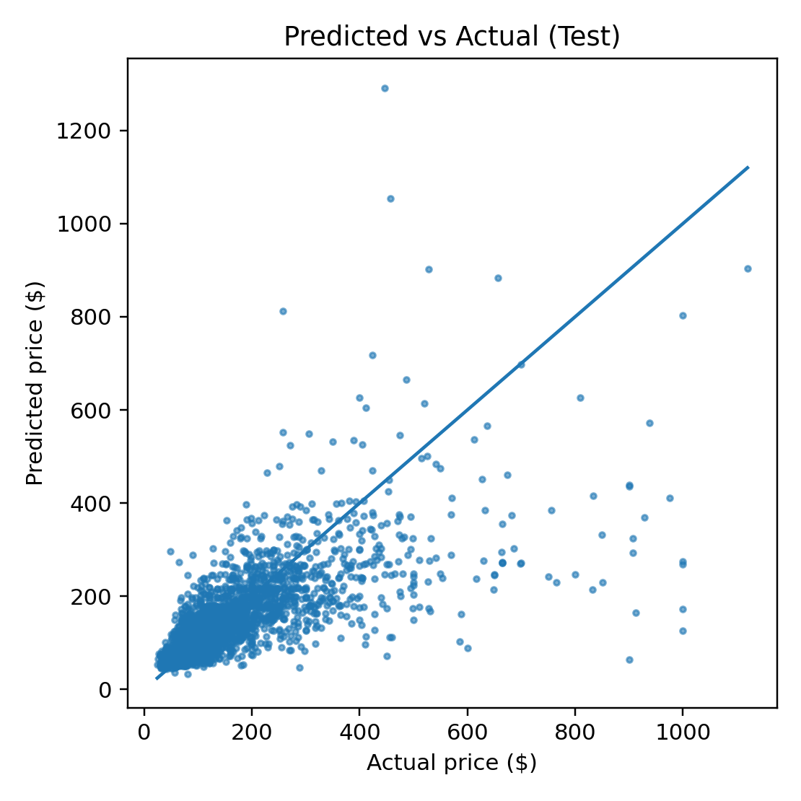
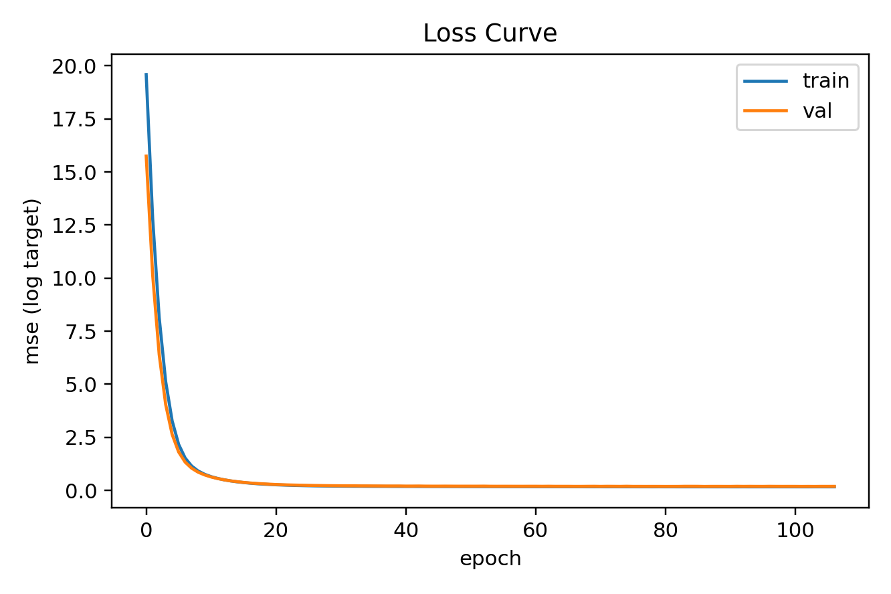
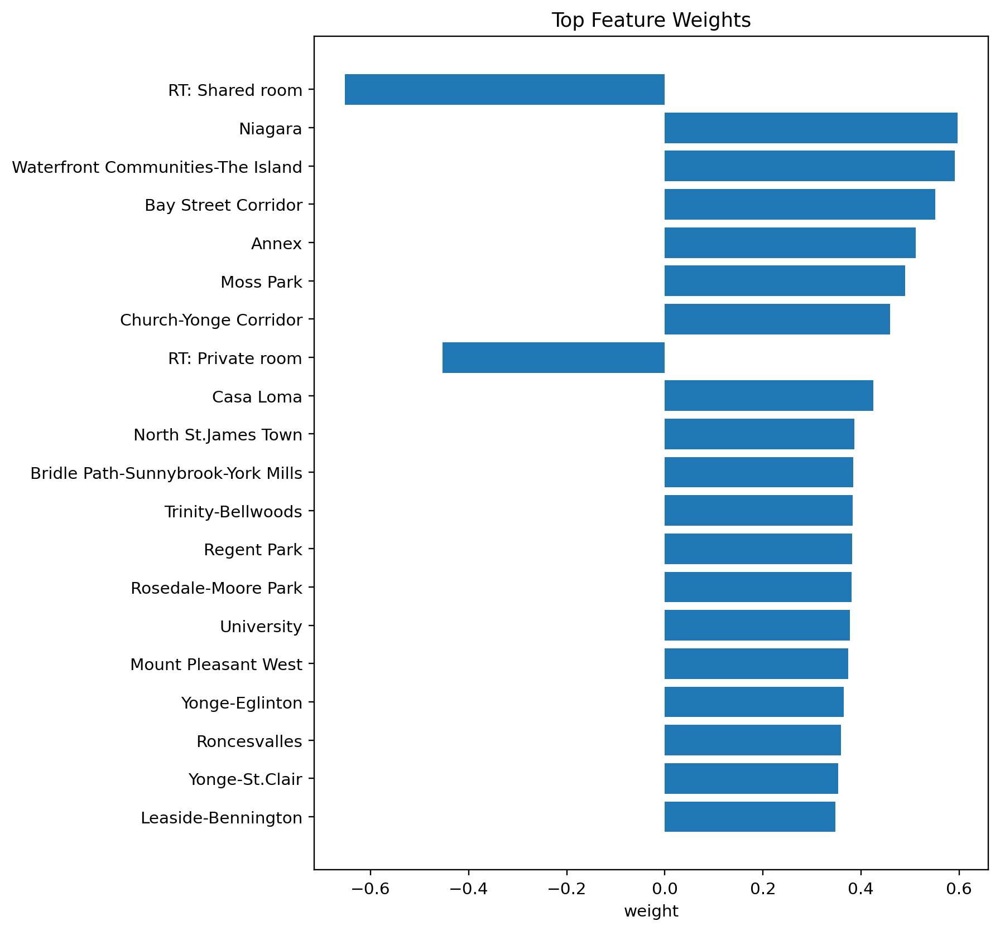

This is my work with Torch and scikit to build a linear regression model that predicts Toronto Airbnb nightly prices.

The model was trained locally on an M4 Pro MacBook Pro using the Apple MPS backend for PyTorch acceleration.
After cleaning the dataset, the script split the data into:

Train: 10,866 rows
Validation: 2,330 rows
Test: 2,329 rows

Training stopped automatically at epoch 106 due to early-stopping on validation loss.
Final evaluation on the test set gave the following metrics (on the original $ scale):

MAE	$56.01
RMSE	$101.75
R^2	0.4565

   

Predicted vs Actual - Each point is a listing. The closer to the diagonal, the better the prediction.

Loss Curve - Training and validation MSE over epochs; early stopping kicks in when validation no longer improves.

Top Feature Weights - Largest positive/negative weights in the standardized / one-hot space.

**How it works:**
  1) Loads & clean csv data.  
  2) Split into train/val/test (~70/15/15).  
  3) Preprocess with **scikit-learn**: StandardScaler for numeric features and OneHotEncoder (drop-first) for categorical features.  
  4) Train a **PyTorch** linear regressor (Adam + L2, early stopping on validation loss).  
  5) Evaluate on the test set, undoing the log transform to report MAE / RMSE / R^2 on the original $ scale.  
  6) Save artifacts.

---

**Data**
- Source: Listing data is sourced from https://insideairbnb.com/get-the-data/ (Toronto)
- Target: nightly `price` (USD), parsed from strings like `$123.00` -> `123.0`  
- Features:
  - Numeric: `accommodates`, `bedrooms`, `bathrooms`, `minimum_nights`, `availability_365`
  - Categorical (one-hot): `neighbourhood_cleansed`, `room_type`
- Basic cleaning: drop NAs in the above columns, keep prices in a reasonable range
